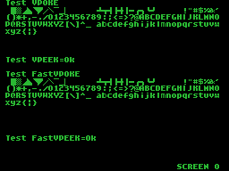

# VDP TMS9918A MSX SDCC Library (fR3eL Project)

<table>
<tr><td>Name</td><td>VDP_TMS9918A</td></tr>
<tr><td>Architecture</td><td>MSX</td></tr>
<tr><td>Environment</td><td>ROM, MSX-DOS or BASIC</td></tr>
<tr><td>Format</td><td>SDCC Relocatable object file (.rel)</td></tr>
<tr><td>Programming language</td><td>C and Z80 assembler</td></tr>
<tr><td>Compiler</td><td>SDCC v4.4 or newer</td></tr>
</table>

 

## Description

C Library functions to work with the TMS9918A/28A/29A video processor.

This library contains a collection of functions for basic access to VDP capabilities, such as: 
initializing display modes, accessing registers, accessing video memory, and displaying sprites.

It is optimized to offer the highest possible speed when using the TMS9918A VDP, especially in functions that work with data blocks (FillVRAM, CopyToVRAM and CopyFromVRAM). 
Fast read/write functions (FastVPOKE and FastVPEEK) have been added, which access the next used video memory cell.

It is designed to develop applications for MSX computers in any of the different environments available (ROM, MSX-DOS or MSX BASIC), 
using the Small Device C Compiler [(SDCC)](http://sdcc.sourceforge.net/) cross compiler.

You can complement it with any of these libraries:
- [VDP_PRINT](https://github.com/mvac7/fR3eL_VDP_PRINT_Lib) library with functions for display text strings in the graphic modes of the TMS9918A (G1 and G2).
- [VDP_SPRITES](https://github.com/mvac7/SDCC_VDP_SPRITES_Lib) Library of functions for directly accessing sprite attributes from the TMS9918A video processor.

You also have a [VDP_TMS9918A_MSXBIOS](https://github.com/mvac7/fR3eL_VDP_TMS9918A_MSXBIOS_Lib) Library, developed using functions of the MSX BIOS. 
The advantage of using the BIOS is that the library is more compact and guarantees compatibility with all MSX models, but the video memory access functions are slow.

You can access the documentation here with [`How to use the library`](docs/HOWTO.md).

These libraries are part of the [MSX fR3eL Project](https://github.com/mvac7/SDCC_MSX_fR3eL).

This project is open source under the [MIT license](LICENSE). 
You can add part or all of this code in your application development or include it in other libraries/engines.

Enjoy it!   

 

---

## History of versions

- v1.7 (17/07/2025) 
	- #14 Rename GetSPRattrVADDR function to GetSPRattrVRAM. The GetSPRattrVADDR tag is now used for the inline assembler
	- #15 Fix bug in GetSPRattrVRAM function
	- #16 Change ClearMC function. Now clear the Pattern Table.
- v1.6 (11/07/2025) 
	- #12 Bug Fix in SCREEN function
	- #13 Optimization of multiplications
- v1.5 (11 July 2025):
	- Convert Assembler source code to C
	- Update to SDCC (4.1.12) Z80 calling conventions
	- Added SetVRAMtoREAD and SetVRAMtoWRITE functions
	- Added FastVPOKE and FastVPEEK functions
	- Added initialization of MultiColor mode (in SCREEN function) with sorted map.
	- Added initialization of the color table in Graphic1 mode (based on the values ​​previously given by the COLOR function).
	- The FillVRAM, CopyToVRAM, and CopyFromVRAM functions have been optimized for faster access to VRAM.
- v1.4 (16 August 2022) Bug #2 (initialize VRAM address in V9938) and code optimization.
- v1.3 (23 July  2019) COLOR function improvements.
- v1.2 ( 4 May   2019) ?
- v1.1 (25 April 2019) ?
- v1.0 (14 February 2014) Initial version

 

---

## Requirements

- [Small Device C Compiler (SDCC) v4.4](http://sdcc.sourceforge.net/)
- [Hex2bin v2.5](http://hex2bin.sourceforge.net/)

 

---

## Functions

### Initialization

| Name      | Declaration | Output | Description |
| :---      | :---        | :---   | :---        |
| SCREEN    | `SCREEN(char mode)` | --- | Initializes the display |
| SortG2map | `SortG2map()` | --- | Initializes the pattern name table with sorted values |
| SortMCmap | `SortMCmap()` | --- | Initializes the pattern name table with sorted values |
| COLOR     | `COLOR(char ink, char background, char border)` | --- | Set the foreground, background, and border screen colors |
| CLS       | `CLS()` | --- | Clear Screen. Fill VRAM Name Table with the value 0 |

 

### Access to the VDP Registers

| Name   | Declaration | Output | Description |
| :---   | :---        | :---   | :---        |
| GetVDP | `GetVDP(char reg)`   | `char` | Gets the value in a VDP register. Provides the mirror value stored in system variables |
| SetVDP | `SetVDP(char, char)` | ---    | Writes a value to a VDP register |

 

### Access to video memory

| Name | Declaration | Output | Description |
| ---  | ---         | ---    | ---         |
| VPOKE          | `VPOKE(unsigned int vaddr, char value)` | --- | Writes a value to VRAM |
| FastVPOKE      | `FastVPOKE(char value)`     | ---    | Writes a value to the next video RAM position |
| VPEEK          | `VPEEK(unsigned int vaddr)` | `char` | Reads a value from VRAM |
| FastVPEEK      | `FastVPEEK(char value)`     | `char` | Reads the next video RAM value |
| FillVRAM       | `FillVRAM(unsigned int vaddr, unsigned int size, char value)` | --- | Fills an area of ​​VRAM with the same value. |
| CopyToVRAM     | `CopyToVRAM(unsigned int addr, unsigned int vaddr, unsigned int size)` | --- | Block transfer from memory to VRAM    |
| CopyFromVRAM   | `CopyFromVRAM(unsigned int vaddr, unsigned int addr, unsigned int size)` | --- | Block transfer from VRAM to memory  |
| SetVDPtoREAD   | `SetVDPtoREAD(unsigned int vaddr)`  | --- | Sets the VDP to read VRAM mode and indicates the start address  |
| SetVDPtoWRITE  | `SetVDPtoWRITE(unsigned int vaddr)` | --- | Sets the VDP to write VRAM mode and indicates the start address |

 

### Access to Sprites

| Name | Declaration | Output | Description |
| ---  | ---         | ---    | ---         |
| SetSpritesSize  | `SetSpritesSize(char size)` | --- | Set size type for the sprites |
| SetSpritesZoom  | `SetSpritesZoom(char zoom)` | --- | Set zoom type for the sprites |
| ClearSprites    | `ClearSprites()` | --- | Initialises the Sprite Attribute Table (OAM) |
| PUTSPRITE       | `PUTSPRITE(char plane, char x, char y, char color, char pattern)` | --- | Displays a sprite |
| GetSPRattrVRAM  | `GetSPRattrVRAM(char plane)` | `unsigned int` | Gets the address in video memory of the Sprite attributes of specified plane |

 

### Inline assembler

| Label | Description | Input Regs. | Output Regs. | Affected Regs. |
| ---   | ---         | ---         | ---          | ---            |
| `readVDP`   | Provides the mirror value of a VDP register stored in system variables | `A` register number (0-7) | `A` value | `HL`, `DE` |
| `writeVDP`  | Writes a value to VDP register | `A` - value `C` - register number (0-7) | --- | `IY`, `DE` |
| `_SetVDPtoWRITE`    | Sets the VDP to write VRAM mode and indicates the start address | `HL` VRAM address | --- | `A` |
| `_SetVDPtoREAD`     | Sets the VDP to read VRAM mode and indicates the start address  | `HL` VRAM address | --- | `A` |
| `WriteByteToVRAM`  | Writes a value to the video RAM. Same as VPOKE. | `HL` VRAM address `A` - value | --- | `A'` |
| `_FastVPOKE`        | Writes a value to the last position in video RAM and increments it. | `A` value | --- | --- |
| `_ReadByteFromVRAM` | Reads a value from VRAM | `HL` VRAM address | `A` | --- |
| `_FastVPEEK`        | Reads the next video RAM value. | --- | `A` | --- |
| `fillVR`            | Fill a large area of the VRAM of the same value | `HL` VRAM address `DE` Size `A` value | --- | `BC` |
| `LDIR2VRAM`         | Block transfer from memory to VRAM | `BC` blocklength `DE` source Memory address `HL` target VRAM address | --- | `A` |
| `GetBLOCKfromVRAM`  | Block transfer from VRAM to memory | `BC` blocklength `HL` source VRAM address `DE` target RAM address | --- | `A` |
| `GetSPRattrVADDR`   | Gets the VRAM address of the Sprite attributes of the specified plane | `A` sprite plane (0-31) | `HL` VRAM address | `DE` |
| `GetSpritePattern`  | Returns the pattern value according to the Sprite size | `E` sprite pattern | `A` pattern position | --- |

 

---

## Notes about operation

It's important to note that some functions in this library don't work the same as their counterparts in the BIOS. 
This is because we've tried to make this library as fast and compact as possible.

Below are the similarities and differences between the BIOS functions and those in this library:

The SCREEN function writes the same configuration from the different tables used in the MSX system (VRAM positioning) to the VDP registers.

All screen modes will be initialized with the pattern name table set to 0, just like the CLS function. 
It's important to note that by default, the BIOS initializes the GRAPHIC2 and MULTICOLOR modes with consecutive values ​​(used to display a graphic without using repeated tiles). 
This is to prevent clutter from displaying previous graphics. For when you need this functionality, the SortG2map or SortMCmap functions have been added.

The SCREEN function will initialize the sprite attribute table with all values ​​set to 0, except for the Y position, which is set to a hidden position (209).

It does not set the MSX system font patterns in text modes (TEXT1 or GRAPHIC1). 
It is assumed that the programmer will be the one to initialize the tileset for the different screens that make up the application, thus avoiding double-writing large blocks of VRAM.

The color and background colors of the COLOR function are only useful in Text1 mode, as in other modes the BIOS uses these values ​​to initialize the color table. 
For these screen modes, it will only be useful for setting the screen border color. 
The COLOR function writes the given values ​​to the system variables: FORCLR, BAKCLR, and BDRCLR.

Because the VDP registers cannot be queried, writing their values ​​has been included in the system variables used by the MSX. 
If you want to adapt this library to another computer, you would need to remove it or move it to available memory.

 

You should keep in mind that although this library allows you to work with the Text1 screen mode, you will find in this project the (TEXTMODE)[https://github.com/mvac7/SDCC_TEXTMODE_MSXROM_Lib] library with specific functions to facilitate the development of applications in text mode.

 

---

## Examples
 
The project includes several examples that I have used to test the library and that can help you learn how to use this library.

You can find them in the [`examples/`](examples/) folder.

 

### Example 1 (ROM)

Example included in the HOWTO document.

[`examples/Example01`](examples/Example01)

 

 

### Example 2 (ROM)

This example tests all of the library's functions in the four screen modes of the TMS9918A. 
Test the functionality of the library in a system environment for ROM (BIOS+ROM+RAM+RAM).

[`examples/Example02`](examples/Example02)

 

 

 

### Example 3 (MSX-DOS)

This example tests all of the library's functions in the four screen modes of the TMS9918A. 
Test the functionality of the library in a system environment for MSX-DOS.

[`examples/Example03`](examples/Example02)

 

 

 

---

## Documentation

- Texas Instruments [TMS9918A application manual](http://map.grauw.nl/resources/video/texasinstruments_tms9918.pdf) `PDF`
- Texas Instruments [VDP Programmer’s Guide](http://map.grauw.nl/resources/video/ti-vdp-programmers-guide.pdf) `PDF`
- Texas Instruments [TMS9918A VDP](http://bifi.msxnet.org/msxnet/tech/tms9918a.txt) by Sean Young `TXT`
- The MSX Red Book · [2 Video Display Processor](https://github.com/gseidler/The-MSX-Red-Book/blob/master/the_msx_red_book.md#chapter_2) `HTML`
- YAMAHA [9938 Technical Data Book](http://map.grauw.nl/resources/video/v9938/v9938.xhtml) `HTML`
