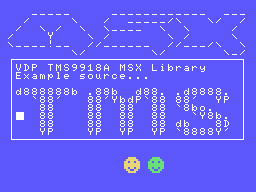

# How to use the VDP_TMS9918A MSX Library

| Attention! |
| :---       |
| The following document has been written using an English translator.<br/>You can participate in the improvement of this document, transmitting your corrections or suggestions in the issues of this project or the main fR3eL project.<br/>Thanks for understanding. |

<br/>

## Index

- [1 Description](#1-Description)
- [2 Requirements](#2-Requirements)
- [3 Definitions](#3-Definitions)
    - [3.1 VDP Ports](#31-VDP-Ports)
	- [3.2 VDP Registers](#32-VDP-Registers)
	- [3.3 Screen Modes](#33-Screen-Modes)
	- [3.4 Sprite Sizes](#34-Sprite-Sizes)
	- [3.5 Sprite Zoom](#35-Sprite-Zoom)
	- [3.6 Color Names](#36-Color-Names)
	- [3.7 VDP base address tables](#37-VDP-base-address-tables)
	- [3.8 VDP base address tables 2 (BASE type)](#38-VDP-base-address-tables-2-(BASE-type))
	- [3.9 G2 Tileset Bank addends](#39-G2-Tileset-Bank-addends)
- [4 Functions](#4-Functions)
	- [4.1 Initialization](#41-Initialization)
		- [4.1.1 SCREEN](#411-SCREEN)
		- [4.1.2 COLOR](#412-COLOR)
		- [4.1.3 CLS](#413-CLS)
		- [4.1.4 SortG2map](#414-SortG2map)
		- [4.1.5 SortMCmap](#415-SortMCmap)		
	- [4.2 Access to the VDP Registers](#42-Access-to-the-VDP-Registers)
		- [4.2.1 GetVDP](#421-GetVDP)
		- [4.2.2 SetVDP](#422-SetVDP)	
	- [4.3 Access to video memory](#43-Access-to-video-memory)
		- [4.3.1 VPOKE](#431-VPOKE)
		- [4.3.2 FastVPOKE](#432-FastVPOKE)
		- [4.3.3 VPEEK](#433-VPEEK)
		- [4.3.4 FastVPEEK](#434-FastVPEEK)
		- [4.3.5 FillVRAM](#435-FillVRAM)
		- [4.3.6 CopyToVRAM](#436-CopyToVRAM)
		- [4.3.7 CopyFromVRAM](#437-CopyFromVRAM)
		- [4.3.8 SetVDPtoREAD](#438-SetVDPtoREAD)
		- [4.3.9 SetVDPtoWRITE](#439-SetVDPtoWRITE)	
	- [4.4 Access to Sprites](#44-Access-to-Sprites)
		- [4.4.1 SetSpritesSize](#442-SetSpritesSize)
		- [4.4.2 SetSpritesZoom](#443-SetSpritesZoom)
		- [4.4.3 ClearSprites](#441-ClearSprites)
		- [4.4.4 PUTSPRITE](#444-PUTSPRITE)
		- [4.4.5 GetSPRattrVRAM](#445-GetSPRattrVRAM)		
	- [4.5 Inline assembler](#45-Inline-assembler)
		- [4.5.1 writeVDP](#451-writeVDP)	
		- [4.5.2 readVDP](#452-readVDP)
		- [4.5.3 SetVDPtoWRITE](#453-SetVDPtoWRITE)
		- [4.5.4 SetVDPtoREAD](#454-SetVDPtoREAD)		
		- [4.5.5 WriteByteToVRAM](#455-WriteByteToVRAM)		
		- [4.5.6 FastVPOKE](#456-FastVPOKE)
		- [4.5.7 ReadByteFromVRAM](#457-ReadByteFromVRAM)
		- [4.5.8 FastVPEEK](#458-FastVPEEK)		
		- [4.5.9 fillVR](#459-fillVR)
		- [4.5.10 LDIR2VRAM](#4510-LDIR2VRAM)
		- [4.5.11 GetBLOCKfromVRAM](#4511-GetBLOCKfromVRAM)		
		- [4.5.12 GetSPRattrVADDR](#4512-GetSPRattrVADDR)
		- [4.5.13 GetSpritePattern](#4513-GetSpritePattern)
- [5 Tech notes](#5-Tech-notes)
- [6 Code Example](#6-Code-Example)
- [7 References](#7-References)


<br/>

---


## 1 Description

C Library functions to work with the TMS9918A/28A/29A video processor.

This library contains a collection of functions for basic access to VDP capabilities, such as: 
initializing display modes, accessing registers, accessing video memory, and displaying sprites.

It is optimized to offer the highest possible speed when using the TMS9918A VDP, especially in functions that work with data blocks (FillVRAM, CopyToVRAM and CopyFromVRAM). 
Fast read/write functions (FastVPOKE and FastVPEEK) have been added, which access the next used video memory cell.

It is designed to develop applications for MSX computers in any of the different environments available (ROM, MSX-DOS or MSX BASIC), 
using the Small Device C Compiler [(SDCC)](http://sdcc.sourceforge.net/) cross compiler.

You can complement it with any of these libraries:
- [VDP_PRINT](https://github.com/mvac7/fR3eL_VDP_PRINT_Lib) library with functions for display text strings in the graphic modes of the TMS9918A (G1 and G2).
- [VDP_SPRITES](https://github.com/mvac7/SDCC_VDP_SPRITES_Lib) Library of functions for directly accessing sprite attributes from the TMS9918A video processor.

You also have a [VDP_TMS9918A_MSXBIOS](https://github.com/mvac7/fR3eL_VDP_TMS9918A_MSXBIOS_Lib) Library, developed using functions of the MSX BIOS. 
The advantage of using the BIOS is that the library is more compact and guarantees compatibility with all MSX models, but it has the disadvantage of being slow.

These libraries are part of the [MSX fR3eL Project](https://github.com/mvac7/SDCC_MSX_fR3eL).

This project is open source under the [MIT license](LICENSE). 
You can add part or all of this code in your application development or include it in other libraries/engines.

<br/>

---


## 2 Requirements

- [Small Device C Compiler (SDCC) v4.4](http://sdcc.sourceforge.net/)
- [Hex2bin v2.5](http://hex2bin.sourceforge.net/)

<br/>

---

## 3 Definitions

### 3.1 VDP Ports

Label		| Value
:---		| :---
VDPVRAM		| 0x98
VDPSTATUS	| 0x99

<br/>

### 3.2 VDP Registers

Label	| Value
:---	| :---
VDP_Mode0		| 0
VDP_Mode1		| 1
VDP_BGmap		| 2
VDP_BGcolors	| 3
VDP_BGtiles		| 4
VDP_OBJattr		| 5
VDP_OBJtiles	| 6
VDP_Color		| 7

<br/>

### 3.3 Screen Modes

To use them in the SCREEN(mode) function.

Label		| Value | MSX BASIC	| Description
:---		| ---:	| :---		| :---
TEXT1		| 0		| SCREEN 0	| Text mode 40col
GRAPHIC1	| 1		| SCREEN 1	| Graphics 1 mode
GRAPHIC2	| 2		| SCREEN 2	| Graphics 2 mode
MULTICOLOR	| 3		| SCREEN 3	| Multicolor mode 64x48 blocks

<br/>

### 3.4 Sprite Sizes

Label			| Value
:---			| ---:
SPRITES8x8		| 0
SPRITES16x16	| 1

<br/>

### 3.5 Sprite Zoom

Label			| Value
:---			| ---:
SPRITESzoomX1	| 0
SPRITESzoomX2	| 1

<br/>

### 3.6 Color Names

Label		| Value
:---		| ---:
TRANSPARENT	| 0
BLACK		| 1
GREEN		| 2
LIGHT_GREEN	| 3
DARK_BLUE	| 4
LIGHT_BLUE	| 5
DARK_RED	| 6
CYAN		| 7
RED			| 8
LIGHT_RED	| 9
DARK_YELLOW	| 10
LIGHT_YELLOW	| 11
DARK_GREEN	| 12
MAGENTA		| 13
GRAY		| 14
WHITE		| 15

<br/>

### 3.7 VDP base address tables 1

Definition of the video memory addresses where the different graphic data tables are located.

<table>
<tr><th align="left">Notes:</th></tr>
<tr><td>These addresses are those used by default by the MSX system.</td></tr>
<tr><td>The sprite pattern and attribute tables are the same for GRAPHIC1, GRAPHIC2, and Multicolor modes.</td></tr>
</table>

<br/>

#### Text1 (Screen 0)

Label	| Value	| Description
:---	| :---	| :---
T1_MAP	| 0x0000	| T1 Name Table
T1_PAT	| 0x0800	| T1 Pattern Table

<br/>

#### Graphic1 (Screen 1)

Label	| Value	| Description
:---	| :---	| :---
G1_MAP	| 0x1800	| Name Table
G1_PAT	| 0x0000	| Pattern Table
G1_COL	| 0x2000	| Color Table
G2_MAP	| 0x1800	| Name Table
G2_PAT	| 0x0000	| Pattern Table

<br/>

#### Graphic2 (Screen 2)

Label	| Value	| Description
:---	| :---	| :---
G2_PAT_A	| 0x0000	| Pattern Table Bank A
G2_PAT_B	| 0x0800	| Pattern Table Bank B
G2_PAT_C	| 0x1000	| Pattern Table Bank C
G2_COL	| 0x2000	| Color Table
G2_COL_A	| 0x2000	| Color Table Bank A
G2_COL_B	| 0x2800	| Color Table Bank B
G2_COL_C	| 0x3000	| Color Table Bank C


**Example:**

```c
	//Copy a tileset patterns to the three banks of the Screen2 graphic mode
	CopyToVRAM((unsigned int) TilesetDATA_PAT,G2_PAT_A,0x800);
	CopyToVRAM((unsigned int) TilesetDATA_PAT,G2_PAT_B,0x800);
	CopyToVRAM((unsigned int) TilesetDATA_PAT,G2_PAT_C,0x800);
```

<br/>

#### MultiColor (Screen 3)

Label	| Value	| Description
:---	| :---	| :---
MC_MAP	| 0x0800	| Name Table
MC_PAT	| 0x0000	| Pattern Table <br/> (A tile contains the color data of 2x2 blocks)

<br/>

#### Spites

Label	| Value	| Description
:---	| :---	| :---
SPR_OAM	| 0x1B00	| Sprite Attribute Table (Object Attribute Memory)
SPR_PAT	| 0x3800	| Sprite Pattern Table

<br/>

### 3.8 VDP base address tables 2 (BASE type)

Definition of the video memory addresses where the different graphic data tables are located.
Based on the BASE instruction of MSX BASIC.

<table>
<tr><th align="left">Note:</th></tr>
<tr><td>These addresses are those used by default by the MSX system.</td></tr>
</table>

<br/>

#### Text1 (Screen 0)

Label	| Value		| Description
:---	| :---		| :---
BASE0	| 0x0000	| Name Table
BASE2	| 0x0800	| Pattern Table

<br/>

#### Graphic1 (Screen 1)
Label	| Value		| Description
:---	| :---		| :---
BASE5	| 0x1800	| Name Table
BASE6	| 0x2000	| Color Table
BASE7	| 0x0000	| Pattern Table
BASE8	| 0x1B00	| Sprite Attribute Table (OAM*)
BASE9	| 0x3800	| Sprite Pattern Table

<br/>

#### Graphic2 (Screen 2)
Label	| Value		| Description
:---	| :---		| :---
BASE10	| 0x1800	| Name Table
BASE11	| 0x2000	| Color Table
BASE12	| 0x0000	| Pattern Table
BASE13	| 0x1B00	| Sprite Attribute Table (OAM*)
BASE14	| 0x3800	| Sprite Pattern Table

<br/>

#### Multicolor (Screen 3)
Label	| Value		| Description
:---	| :---		| :---
BASE15	| 0x0800	| Name Table
BASE17	| 0x0000	| Pattern Table
BASE18	| 0x1B00	| Sprite Attribute Table (OAM*)
BASE19	| 0x3800	| Sprite Pattern Table

__***OAM** = Object Attribute Memory__

<br/>

### 3.9 G2 Tileset Bank addends

Labels to facilitate the positioning of the tileset banks in G2 mode.

Label	| Value
:---	| :---
BANK0	| 0x0000
BANK1	| 0x0800
BANK2	| 0x1000

<br/>

#### Example:

```c
	//Copy a tileset patterns to the three banks of the Screen2 graphic mode
	CopyToVRAM((unsigned int) TilesetDATA_PAT,BASE12+BANK0,0x800);
	CopyToVRAM((unsigned int) TilesetDATA_PAT,BASE12+BANK1,0x800);
	CopyToVRAM((unsigned int) TilesetDATA_PAT,BASE12+BANK2,0x800);
```

<br/>

---


## 4 Functions

### 4.1 Initialization

#### 4.1.1 SCREEN

<table>
<tr><th colspan=3 align="left">SCREEN</th></tr>
<tr><td colspan=3>Initializes the display to one of the four standardized modes on the MSX.<ul>
<li>All screen modes will be initialized with the pattern name table set to 0, just like the CLS function.</li>  
<li>Initialization of the color table in GRAPHIC1 mode (based on the values ​​previously given by the COLOR function).</li>
<li>Initializing the Sprite Attribute Table (OAM) in graphic modes.</li></ul></td></tr>
<tr><th>Function</th><td colspan=2>SCREEN(mode)</td></tr>
<tr><th>Input</th><td>char</td><td>Screen mode (0-3)<br/>0 = Text1<br/>1 = Graphic1<br/>2 = Graphic2<br/>3 = MultiColor</td></tr>
<tr><th>Output</th><td colspan=2>-</td></tr>
</table>

You can use the definitions: [3.3 Screen Modes](#33-Screen-Modes)

##### Examples:

```c
	SCREEN(2);
```

```c
	SCREEN(GRAPHIC1);
```

<br/>

#### 4.1.2 COLOR

<table>
<tr><th colspan=3 align="left">COLOR</th></tr>
<tr><td colspan=3>Put the ink, background and foreground colors.<br/>This function has different behaviors depending on the screen mode.<br/>
In Text1 mode, the color change is instantaneous except the border color which has no effect.<br/>
In Graphic1, Graphic2 and MultiColor modes, only the border color has an instant effect.<br/>
Ink and background colors are only used when starting the screen with the SCREEN() function.</td></tr>
<tr><th>Function</th><td colspan=2>COLOR(ink, background, border)</td></tr>
<tr><th rowspan=3>Input</th><td>char</td><td>Ink color (0-15)</td></tr>
<tr><td>char</td><td>Background color (0-15)</td></tr>
<tr><td>char</td><td>Border color (0-15)</td></tr>
<tr><th>Output</th><td colspan=2>-</td></tr>
</table>

You can use the definitions: [3.6 Color Names](#36-Color-Names)

##### Examples:

```c
	COLOR(1,14,15);
	SCREEN(0);
```

```c
	COLOR(GRAY,DARK_BLUE,LIGHT_BLUE);
	SCREEN(GRAPHIC1);
```

<br/>

#### 4.1.3 CLS

<table>
<tr><th colspan=3 align="left">CLS</th></tr>
<tr><td colspan=3>Clear Screen.<br/>Fill VRAM Name Table with the value 0.</td></tr>
<tr><th>Function</th><td colspan=2>CLS()</td></tr>
<tr><th>Input</th><td colspan=2>-</td></tr>
<tr><th>Output</th><td colspan=2>-</td></tr>
</table>

##### Example:

```c
	CLS();
```

<br/>

#### 4.1.4 SortG2map

<table>
<tr><th colspan=3 align="left">SortG2map</th></tr>
<tr><td colspan=3>Initializes the pattern name table, with sorted values.<br/>Designed to be able to display a Graphic2 (256x192px) image.</td></tr>
<tr><th>Function</th><td colspan=2>SortG2map()</td></tr>
<tr><th>Input</th><td colspan=2>-</td></tr>
<tr><th>Output</th><td colspan=2>-</td></tr>
</table>

##### Example:

```c
	SCREEN(2);
	SortG2map();
```

<br/>

#### 4.1.5 SortMCmap

<table>
<tr><th colspan=3 align="left">SortMCmap</th></tr>
<tr><td colspan=3>Initializes the pattern name table, with sorted values.<br/>Designed to be able to display a MultiColor (64x48 blocks) image.</td></tr>
<tr><th>Function</th><td colspan=2>SortMCmap()</td></tr>
<tr><th>Input</th><td colspan=2>-</td></tr>
<tr><th>Output</th><td colspan=2>-</td></tr>
</table>

##### Example:

```c
	SCREEN(MULTICOLOR);
	SortMCmap();
```

<br/>


---
### 4.2 Access to the VDP Registers

#### 4.2.1 GetVDP

<table>
<tr><th colspan=3 align="left">GetVDP</th></tr>
<tr><td colspan=3>Gets the value in a VDP register.<br/>Provides the mirror value of a VDP register stored in system variables (RG0SAV=0x0xF3DF).</td></tr>
<tr><th>Function</th><td colspan=2>GetVDP(register)</td></tr>
<tr><th>Input</th><td>char</td><td>VDP register (0-7)</td></tr>
<tr><th>Output</th><td>char</td><td>Value</td></tr>
</table>

##### Example:

```c
/* =============================================================================
Indicates whether Text 1 mode is active.
Output:	1=Yes/True ; 0=No/False
============================================================================= */
char isText1Mode(void)
{
	char m1=GetVDP(VDP_Mode1);
	if (m1&0b00010000) return 1; 		//Text 40col Mode
	return 0;	
}
```

<br/>

#### 4.2.2 SetVDP

<table>
<tr><th colspan=3 align="left">SetVDP</th></tr>
<tr><td colspan=3>Writes a value to a VDP register and saves the value in the system variables (RG0SAV=0x0xF3DF).</td></tr>
<tr><th>Function</th><td colspan=2>SetVDP(register, value)</td></tr>
<tr><th rowspan=2>Input</th><td>char</td><td>VDP register (0-7)</td></tr>
<tr><td>char</td><td>value</td></tr>
<tr><th>Output</th><td colspan=2>-</td></tr>
</table>

##### Example:

```c
	char m1=GetVDP(VDP_Mode1);
	SetVDP(VDP_Mode1,m1 | 0b01000000); //BLK Enable
```

<br/>


---
### 4.3 Access to video memory

#### 4.3.1 VPOKE

<table>
<tr><th colspan=3 align="left">VPOKE</th></tr>
<tr><td colspan=3>Writes a value to the video RAM.</td></tr>
<tr><th>Function</th><td colspan=2>VPOKE(VRAMaddr,value)</td></tr>
<tr><th rowspan=2>Input</th><td>unsigned int</td><td>VRAM address</td></tr>
<tr><td>char</td><td>Value</td></tr>
<tr><th>Output</th><td colspan=2>-</td></tr>
</table>

##### Example:

```c
	VPOKE(0x1000,1);
	VPOKE(0x1001,0xFF);
```

<br/>

#### 4.3.2 FastVPOKE

<table>
<tr><th colspan=3 align="left">FastVPOKE</th></tr>
<tr><td colspan=3>Writes a value to the last position in video RAM and increments it.<br/>
This is a fast way to write consecutive values ​​to VRAM.<br/>
Requires the VDP to be in write mode, using the SetVDPtoWRITE or VPOKE function at the beginning of the sequence.</td></tr>
<tr><th>Function</th><td colspan=2>FastVPOKE(value)</td></tr>
<tr><th rowspan=1>Input</th><td>char</td><td>Value</td></tr>
<tr><th>Output</th><td colspan=2>-</td></tr>
</table>

##### Examples:

```c
	VPOKE(SPR_OAM,128);	//Sprite plane 0, y=128
	FastVPOKE(74);		//Sprite plane 0, x=74 
```

```c
	char i;
	SCREEN(GRAPHIC1);
	SetVRAMtoWRITE(G1_COL);
	for(i=0;i<32;i++) FastVPOKE(0x51);
```

<br/>

#### 4.3.3 VPEEK

<table>
<tr><th colspan=3 align="left">VPEEK</th></tr>
<tr><td colspan=3>Reads a value from the video RAM.</td></tr>
<tr><th>Function</th><td colspan=2>VPEEK(VRAMaddr)</td></tr>
<tr><th>Input</th><td>unsigned int</td><td>VRAM address</td></tr>
<tr><th>Output</th><td>char</td><td>Value</td></tr>
</table>

##### Example:

```c
	char value;
	value=VPEEK(SPR_OAM);
```

<br/>

#### 4.3.4 FastVPEEK

<table>
<tr><th colspan=3 align="left">FastVPEEK</th></tr>
<tr><td colspan=3>Reads the next video RAM value.<br/>Requires the VDP to be in read mode, either by previously using VPEEK or SetVRAMtoREAD functions.</td></tr>
<tr><th>Function</th><td colspan=2>FastVPEEK()</td></tr>
<tr><th>Input</th><td colspan=2>-</td></tr>
<tr><th>Output</th><td>char</td><td>Value</td></tr>
</table>

##### Example:

```c
	char sprY,sprX,sprPattern,sprColor;
	unsigned int vaddr = GetSPRattrVRAM(10); //Gets the VRAM address of the Sprite attributes of plane 10.
	sprY=VPEEK(vaddr);
	sprX=FastVPEEK();
	sprPattern=FastVPEEK();
	sprColor=FastVPEEK();
```

<br/>

#### 4.3.5 FillVRAM

<table>
<tr><th colspan=3 align="left">FillVRAM</th></tr>
<tr><td colspan=3>Fill a large area of the VRAM of the same value.</td></tr>
<tr><th>Function</th><td colspan=2>FillVRAM(VRAMaddr, size, value)</td></tr>
<tr><th rowspan=3>Input</th><td>unsigned int</td><td>VRAM address</td></tr>
<tr><td>unsigned int</td><td>block size</td></tr>
<tr><td>char</td><td>Value</td></tr>
<tr><th>Output</th><td colspan=2>-</td></tr>
</table>

##### Example:

```c
	FillVRAM(G1_MAP,0x300,32);
```

<br/>

#### 4.3.6 CopyToVRAM

<table>
<tr><th colspan=3 align="left">CopyToVRAM</th></tr>
<tr><td colspan=3>Block transfer from memory to VRAM.</td></tr>
<tr><th>Function</th><td colspan=2>CopyToVRAM(MEMaddr, VRAMaddr, size)</td></tr>
<tr><th rowspan=3>Input</th><td>unsigned int</td><td>Memory address</td></tr>
<tr><td>unsigned int</td><td>VRAM address</td></tr>
<tr><td>unsigned int</td><td>block size</td></tr>
<tr><th>Output</th><td colspan=2>-</td></tr>
</table>

##### Example:

```c
	const char test_MAP[]={0x00,0x20,0x20,0x20,0x5F,0x5F,0x5F,0x5F,0x5F,0x20,0x20,0x20,0x20,0x20,
	0x5F,0x5F,0x5F,0x5F,0x5F,0x5F,0x5F,0x5F,0x5F,0x5F,0x5F,0x5F,0x20,0x20,0x5F,0x5F,0x5F,0x00};
	CopyToVRAM((unsigned int) test_MAP,G1_MAP,32);
```

<br/>


#### 4.3.7 CopyFromVRAM

<table>
<tr><th colspan=3 align="left">CopyFromVRAM</th></tr>
<tr><td colspan=3>Block transfer from VRAM to RAM.</td></tr>
<tr><th>Function</th><td colspan=2>CopyFromVRAM(VRAMaddr, RAMaddr, size)</td></tr>
<tr><th rowspan=3>Input</th><td>unsigned int</td><td>VRAM address</td></tr>
<tr><td>unsigned int</td><td>RAM address</td></tr>
<tr><td>unsigned int</td><td>block size</td></tr>
<tr><th>Output</th><td colspan=2>-</td></tr>
</table>

##### Example:

```c
	CopyFromVRAM(SPR_OAM,0xD000,32*4);
```

<br/>

#### 4.3.8 SetVDPtoREAD
	
<table>
<tr><th colspan=3 align="left">SetVDPtoREAD</th></tr>
<tr><td colspan=3>Sets the VDP to read VRAM mode and indicates the start address.</td></tr>
<tr><th>Function</th><td colspan=2>SetVDPtoREAD(vaddr)</td></tr>
<tr><th>Input</th><td>unsigned int</td><td>VRAM address</td></tr>
<tr><th>Output</th><td colspan=2>-</td></tr>
</table>

##### Examples:

```c
	char sprY,sprX,sprPattern,sprColor;
	SetVDPtoREAD(SPR_OAM);
	sprY=FastVPEEK();
	sprX=FastVPEEK();
	sprPattern=FastVPEEK();
	sprColor=FastVPEEK();
```

<br/>

#### 4.3.9 SetVDPtoWRITE

<table>
<tr><th colspan=3 align="left">SetVDPtoWRITE</th></tr>
<tr><td colspan=3>Sets the VDP to write VRAM mode and indicates the start address.</td></tr>
<tr><th>Function</th><td colspan=2>SetVDPtoWRITE(vaddr)</td></tr>
<tr><th>Input</th><td>unsigned int</td><td>VRAM address</td></tr>
<tr><th>Output</th><td colspan=2>-</td></tr>
</table>

##### Examples:

```c
	SetVRAMtoWRITE(SPR_OAM+(10*4));	//sprite plane 10
	FastVPOKE(120);					//y
	FastVPOKE(64);					//x
	FastVPOKE(nSprPattern*4);		//pattern: multiply by 4 for 16x16 Sprites
	FastVPOKE(LIGHT_BLUE);			//color
```

<br/>


---
### 4.4 Access to Sprites

#### 4.4.1 SetSpritesSize

<table>
<tr><th colspan=3 align="left">SetSpritesSize</th></tr>
<tr><td colspan=3>Set size type for the sprites.</td></tr>
<tr><th>Function</th><td colspan=2>SetSpritesSize(size)</td></tr>
<tr><th>Input</th><td>char</td><td>Size:<br/>0=8x8<br/>1=16x16)</td></tr>
<tr><th>Output</th><td colspan=2>-</td></tr>
</table>

##### Examples:

```c
	SetSpritesSize(0);	//8x8
```

```c
	SetSpritesSize(SPRITES16x16);
```

<br/>


#### 4.4.2 SetSpritesZoom

<table>
<tr><th colspan=3 align="left">SetSpritesZoom</th></tr>
<tr><td colspan=3>Set zoom type for the sprites.</td></tr>
<tr><th>Function</th><td colspan=2>SetSpritesZoom(zoom)</td></tr>
<tr><th>Input</th><td>char or boolean or switcher</td><td>zoom:<br/>0/false/OFF = x1<br/>1/true/ON = x2</td></tr>
<tr><th>Output</th><td colspan=2>-</td></tr>
</table>

| Note: |
| :---  |
| To use `boolean` or `switcher` types, you must include the "newTypes.h" header in your source, which you will find in the main fR3eL repository. |


##### Examples:

```c
	SetSpritesZoom(0);	//No zoom
```

```c
	SetSpritesSize(SPRITES16x16);
	SetSpritesZoom(ON);
```

<br/>


#### 4.4.3 ClearSprites

<table>
<tr><th colspan=3 align="left">ClearSprites</th></tr>
<tr><td colspan=3>Initialises the sprite attribute table.</td></tr>
<tr><th>Function</th><td colspan=2>ClearSprites()</td></tr>
<tr><th>Input</th><td colspan=2>-</td></tr>
<tr><th>Output</th><td colspan=2>-</td></tr>
</table>

##### Example:

```c
	ClearSprites();
	CLS();
```

<br/>


#### 4.4.4 PUTSPRITE

<table>
<tr><th colspan=3 align="left">PUTSPRITE</th></tr>
<tr><td colspan=3>Displays a Sprite on the screen.</td></tr>
<tr><th>Function</th><td colspan=2>PUTSPRITE(plane, x, y, color, pattern)</td></tr>
<tr><th rowspan=5>Input</th><td>char</td><td>sprite plane (0-31)</td></tr>
<tr><td>char</td><td>X coordinate</td></tr>
<tr><td>char</td><td>Y coordinate</td></tr>
<tr><td>char</td><td>Color (0-15)</td></tr>
<tr><td>char</td><td>pattern number</td></tr>
<tr><th>Output</th><td colspan=2>-</td></tr>
</table>

##### Example:

```c
	PUTSPRITE(1,140,156,LIGHT_GREEN,0);	//Put Sprite 0 on plane 1 at coordinates (140,156)
```

<br/>

#### 4.4.5 GetSPRattrVRAM

<table>
<tr><th colspan=3 align="left">GetSPRattrVRAM</th></tr>
<tr><td colspan=3>Gets the address in video memory of the Sprite attributes of specified plane.</td></tr>
<tr><th>Function</th><td colspan=2>GetSPRattrVRAM(plane)</td></tr>
<tr><th>Input</th><td>char</td><td>sprite plane (0-31)</td></tr>
<tr><th>Output</th><td>unsigned int</td><td>VRAM address</td></tr>
</table>

##### Examples:

```c
	unsigned int vaddr;
	
	SetSpritesSize(SPRITES16x16);
	
	vaddr=GetSPRattrVRAM(10);	//sprite plane 10
	
	SetVRAMtoWRITE(vaddr);
	FastVPOKE(120);
	FastVPOKE(64);
	FastVPOKE(nSprPattern*4);	//multiply by 4 for 16x16 Sprites
	FastVPOKE(LIGHT_BLUE);
```

<br/>


---
### 4.5 Inline assembler

Below you will find a list of functions that may be useful for Inline Assembler programming.

<br/>

#### 4.5.1 writeVDP

<table>
<tr><th colspan=3 align="left">writeVDP</th></tr>
<tr><td colspan=3>Writes a value to VDP register.</td></tr>
<tr><th>Label</th><td colspan=2>writeVDP</td></tr>
<tr><th rowspan=2>Input</th><td>A</td><td>value</td></tr>
<tr><td>C</td><td>register number (0-7)</td></tr>
<tr><th>Output</th><td colspan=2>-</td></tr>
<tr><th>Regs.</th><td colspan=2>IY, DE</td></tr>
</table>

##### Example:

```asm
__asm
	ld   A,#0x0E	//Border color
	ld   C,#0x07	//VDP reg 7 colour register
	call writeVDP
__endasm;
```

<br/>

#### 4.5.2 readVDP

<table>
<tr><th colspan=3 align="left">readVDP</th></tr>
<tr><td colspan=3>Provides the mirror value of a VDP register stored in system variables.</td></tr>
<tr><th>Label</th><td colspan=2>readVDP</td></tr>
<tr><th>Input</th><td>A</td><td>register number (0-7)</td></tr>
<tr><th>Output</th><td>A</td><td>value</td></tr>
<tr><th>Regs.</th><td colspan=2>HL, DE</td></tr>
</table>

##### Example:

```asm
__asm
	ld   A,#0x07	//VDP reg 7 colour register
	call readVDP
__endasm;
```

<br/>

#### 4.5.3 SetVDPtoWRITE

<table>
<tr><th colspan=3 align="left">SetVDPtoWRITE</th></tr>
<tr><td colspan=3>Sets the VDP to write VRAM mode and indicates the start address.</td></tr>
<tr><th>Label</th><td colspan=2>_SetVDPtoWRITE</td></tr>
<tr><th>Input</th><td>HL</td><td>VRAM address</td></tr>
<tr><th>Output</th><td colspan=2>-</td></tr>
<tr><th>Regs.</th><td colspan=2>A</td></tr>
</table>

##### Example:

```asm
__asm
	ld   HL,#SPR_OAM
	call _SetVDPtoWRITE
	ld   A,#0xD1
	call _FastVPOKE
__endasm;
```

<br/>

#### 4.5.4 SetVDPtoREAD

<table>
<tr><th colspan=3 align="left">SetVDPtoREAD</th></tr>
<tr><td colspan=3>Sets the VDP to read VRAM mode and indicates the start address.</td></tr>
<tr><th>Label</th><td colspan=2>_SetVDPtoREAD</td></tr>
<tr><th>Input</th><td>HL</td><td>VRAM address</td></tr>
<tr><th>Output</th><td colspan=2>-</td></tr>
<tr><th>Regs.</th><td colspan=2>A</td></tr>
</table>

##### Example:

```asm
__asm
	ld   HL,#SPR_OAM
	call _SetVDPtoREAD
	call _FastVPEEK
	cp   #128
	ret  C		;Y<128
__endasm;
```

<br/>

#### 4.5.5 WriteByteToVRAM

<table>
<tr><th colspan=3 align="left">WriteByteToVRAM</th></tr>
<tr><td colspan=3>Writes a value to the video RAM. Same as VPOKE C function.</td></tr>
<tr><th>Label</th><td colspan=2>WriteByteToVRAM</td></tr>
<tr><th rowspan=2>Input</th><td>HL</td><td>VRAM address</td></tr>
<tr><td>A</td><td>value</td></tr>
<tr><th>Output</th><td colspan=2>-</td></tr>
<tr><th>Regs.</th><td colspan=2>A'</td></tr>
</table>

##### Example:

```asm
__asm
	ld   HL,#SPR_OAM
	ld   A,#0xD1
	call WriteByteToVRAM
__endasm;
```

<br/>

#### 4.5.6 FastVPOKE

<table>
<tr><th colspan=3 align="left">FastVPOKE</th></tr>
<tr><td colspan=3>Writes a value to the last position in video RAM and increments it.<br/>
This is a quick way to write consecutive values ​​to VRAM.<br/>
Requires the VDP to be in write mode, using the SetVDPtoWRITE or WriteByteToVRAM function at the beginning of the sequence.</td></tr>
<tr><th>Label</th><td colspan=2>_FastVPOKE</td></tr>
<tr><th>Input</th><td>A</td><td>value</td></tr>
<tr><th>Output</th><td colspan=2>-</td></tr>
<tr><th>Regs.</th><td colspan=2>-</td></tr>
</table>

##### Examples:

```asm
__asm
	ld   HL,#SPR_OAM
	call _SetVDPtoWRITE
	ld   A,#0x84		//y
	call _FastVPOKE
	ld   A,#0xA0		//x
	call _FastVPOKE
	ld   A,#0x00		//pattern
	call _FastVPOKE
	ld   A,#MAGENTA		//color
	call _FastVPOKE
__endasm;
```

```asm
__asm
	ld   A,#0x84		//y
	ld   HL,#SPR_OAM
	call WriteByteToVRAM
	ld   A,#0xA0		//x
	call _FastVPOKE
	ld   A,#0x00		//pattern
	call _FastVPOKE
	ld   A,#MAGENTA		//color
	call _FastVPOKE
__endasm;
```

<br/>

#### 4.5.7 ReadByteFromVRAM

<table>
<tr><th colspan=3 align="left">ReadByteFromVRAM</th></tr>
<tr><td colspan=3>Reads a value from video RAM</td></tr>
<tr><th>Label</th><td colspan=2>ReadByteFromVRAM</td></tr>
<tr><th>Input</th><td>HL</td><td>VRAM address</td></tr>
<tr><th>Output</th><td>A</td><td>value</td></tr>
<tr><th>Regs.</th><td colspan=2>A</td></tr>
</table>

##### Example:

```asm
__asm
	ld   HL,#SPR_OAM
	call ReadByteFromVRAM
	cp   #128
	jr   NC,StopSPR2right
__endasm;
```

<br/>

#### 4.5.8 FastVPEEK

<table>
<tr><th colspan=3 align="left">FastVPEEK</th></tr>
<tr><td colspan=3>Reads the value from the last position in video RAM and increments it.<br/>
This is a fast way to read consecutive values ​​from VRAM.<br/>
It requires the VDP to be in read mode, using the SetVDPtoREAD or VPEEK function at the beginning of the sequence.</td></tr>
<tr><th>Label</th><td colspan=2>_FastVPEEK</td></tr>
<tr><th>Input</th><td colspan=2>-</td></tr>
<tr><th>Output</th><td>A</td><td>value</td></tr>
<tr><th>Regs.</th><td colspan=2>-</td></tr>
</table>

##### Example:

```asm
__asm
//reads sprite attribute data from the 10 sprite plane
	ld   HL,#SPR_OAM+(10*4)
	call _SetVDPtoREAD
	ld   HL,#OAM_RAMbuffer
	call _FastVPEEK
	ld   (HL),A
	inc  HL
	call _FastVPEEK
	ld   (HL),A
	inc  HL
	call _FastVPEEK
	ld   (HL),A
	inc  HL
	call _FastVPEEK
	ld   (HL),A
__endasm;
```

<br/>

#### 4.5.9 fillVR

<table>
<tr><th colspan=3 align="left">fillVR</th></tr>
<tr><td colspan=3>Fills an area of ​​VRAM with the same value.</td></tr>
<tr><th>Label</th><td colspan=2>fillVR</td></tr>
<tr><th rowspan=3>Input</th><td>HL</td><td>VRAM address</td></tr>
<tr><td>DE</td><td>block size</td></tr>
<tr><td>A</td><td>Value</td></tr>
<tr><th>Output</th><td colspan=2>-</td></tr>
<tr><th>Regs.</th><td colspan=2>BC</td></tr>
</table>

##### Example:

```c
__asm
ClearG1G2:
	xor  A
	ld   DE,#0x300		//32*24
	ld   HL,#G1_MAP
	call fillVR
	ret
__endasm;
```

<br/>

#### 4.5.10 LDIR2VRAM

<table>
<tr><th colspan=3 align="left">LDIR2VRAM</th></tr>
<tr><td colspan=3>Block transfer from memory to VRAM.</td></tr>
<tr><th>Label</th><td colspan=2>LDIR2VRAM</td></tr>
<tr><th rowspan=3>Input</th><td>DE</td><td>source Memory address</td></tr>
<tr><td>HL</td><td>target VRAM address</td></tr>
<tr><td>BC</td><td>block size</td></tr>
<tr><th>Output</th><td colspan=2>-</td></tr>
<tr><th>Regs.</th><td colspan=2>A</td></tr>
</table>

##### Example:

```c
void main(void)
{
	SCREEN(1);
	
__asm
	ld   HL,#G1_PAT
	ld   DE,(#0x0004)	//CGTABL BIOS font address
	ld   BC,#0x800
	call LDIR2VRAM
__endasm;
}
```

<br/>

#### 4.5.11 GetBLOCKfromVRAM

<table>
<tr><th colspan=3 align="left">GetBLOCKfromVRAM</th></tr>
<tr><td colspan=3>Block transfer from VRAM to memory.</td></tr>
<tr><th>Label</th><td colspan=2>GetBLOCKfromVRAM</td></tr>
<tr><th rowspan=3>Input</th><td>HL</td><td>source VRAM address</td></tr>
<tr><td>DE</td><td>target RAM address</td></tr>
<tr><td>BC</td><td>block size</td></tr>
<tr><th>Output</th><td colspan=2>-</td></tr>
<tr><th>Regs.</th><td colspan=2>A</td></tr>
</table>

##### Example:

```c
__asm
	ld   HL,#G1_MAP
	ld   DE,#0xC100
	ld   BC,#0x300
	call GetBLOCKfromVRAM
__endasm;
```

<br/>


#### 4.5.12 GetSPRattrVADDR

<table>
<tr><th colspan=3 align="left">GetSPRattrVADDR</th></tr>
<tr><td colspan=3>Gets the address in video memory of the Sprite attributes of specified plane.</td></tr>
<tr><th>Label</th><td colspan=2>GetSPRattrVADDR</td></tr>
<tr><th>Input</th><td>A</td><td>sprite plane (0-31)</td></tr>
<tr><th>Output</th><td>HL</td><td>VRAM address</td></tr>
<tr><th>Regs.</th><td colspan=2>DE</td></tr>
</table>

##### Example:

```asm
__asm
	ld   A,#10
	call GetSPRattrVADDR		//Input: A<--Sprite plane; Output: HL-->VRAM addr
	call _SetVDPtoWRITE			//Input: HL<--VRAM addr
	ld   A,#SPRITES_YHIDDEN		//hidden sprite plane 10
	call _FastVPOKE
__endasm;
```

<br/>


#### 4.5.13 GetSpritePattern

<table>
<tr><th colspan=3 align="left">GetSpritePattern</th></tr>
<tr><td colspan=3>Returns the pattern value according to the Sprite size<br/>(multiplied by 4 when its 16x16).</td></tr>
<tr><th>Label</th><td colspan=2>GetSpritePattern</td></tr>
<tr><th>Input</th><td>E</td><td>sprite pattern</td></tr>
<tr><th>Output</th><td>A</td><td>pattern position</td></tr>
<tr><th>Regs.</th><td colspan=2>-</td></tr>
</table>

##### Example:

```c
void SetSpritePattern(char plane, char pattern) __naked
{
plane;		//A
pattern;	//L
__asm

	ld   E,L
	
	call GetSPRattrVADDR	//Input: A<--plane; Output: HL-->VRAM addr
	inc  HL
	inc  HL

	call GetSpritePattern	//Input: E<--Sprite pattern; Output: A-->pattern position
	jp   WriteByte2VRAM

__endasm;
}
```

<br/>

---

## 5 Tech notes

It's important to note that some functions in this library don't work the same as their counterparts in the BIOS. 
This is because we've tried to make this library as fast and compact as possible.

Below are the similarities and differences between the BIOS functions and those in this library:

The SCREEN function writes the same configuration from the different tables used in the MSX system (VRAM positioning) to the VDP registers.

All screen modes will be initialized with the pattern name table set to 0, just like the CLS function. 
It's important to note that by default, the BIOS initializes the GRAPHIC2 and MULTICOLOR modes with consecutive values ​​(used to display a graphic without using repeated tiles). 
This is to prevent clutter from displaying previous graphics. For when you need this functionality, the SortG2map or SortMCmap functions have been added.

The SCREEN function will initialize the sprite attribute table with all values ​​set to 0, except for the Y position, which is set to a hidden position (209).

It does not set the MSX system font patterns in text modes (TEXT1 or GRAPHIC1). 
It is assumed that the programmer will be the one to initialize the tileset for the different screens that make up the application, thus avoiding double-writing large blocks of VRAM.

The color and background colors of the COLOR function are only useful in Text1 mode, as in other modes the BIOS uses these values ​​to initialize the color table. 
For these screen modes, it will only be useful for setting the screen border color. 
The COLOR function writes the given values ​​to the system variables: FORCLR, BAKCLR, and BDRCLR.

Because the VDP registers cannot be queried, writing their values ​​has been included in the system variables used by the MSX. 
If you want to adapt this library to another computer, you would need to remove it or move it to available memory.

<br/>

You should keep in mind that although this library allows you to work with the Text1 screen mode, you will find in this project the (TEXTMODE)[https://github.com/mvac7/SDCC_TEXTMODE_MSXROM_Lib] library with specific functions to facilitate the development of applications in text mode.

<br/>

---

## 6 Code Example
 
### Example 1

In this source code you will find a simple example of how to use this library.

Requires the following items:
- Startup file for MSX 8/16K ROM [crt0_MSX816kROM4000](https://github.com/mvac7/SDCC_startup_MSX816kROM4000)
- [VDP_TMS9918A Library](https://github.com/mvac7/SDCC_VDP_TMS9918A_Lib)

<br/>

And you need the following applications to compile and generate the final ROM:
- [Small Device C Compiler (SDCC) v4.4](http://sdcc.sourceforge.net/)
- [Hex2bin v2.5](http://hex2bin.sourceforge.net/)

<br/>

This example performs the following actions:
1. Initializes the screen to Graphic1 mode (Screen 1) with 8x8 sprites in 2x zoom mode.
1. Copy the tileset included in the MSX BIOS to the VRAM Pattern Table using the `CopyToVRAM` function.
1. Dumps the data from the testmap_MAP array to the VRAM Pattern Name Table using the `CopyToVRAM` function.
1. Copy a tile pattern (tile 2) from VRAM to RAM using the `CopyFromVRAM` function.
1. Copy the pattern to the Sprite Pattern Table (from RAM to VRAM) using the `CopyToVRAM` function.
1. Display a Sprite by writing directly to the VRAM Sprite Attribute Table using the `VPOKE` and `FastVPOKE` functions.
1. Display a Sprite using the `PUTSPRITE` function.

<br/>




#### Source code:

```c
/* =============================================================================
# Example01.c
Version: 1.1 (04/07/2025)
Architecture: MSX
Format: MSX ROM 8k
Programming language: C and Z80 assembler
Compiler: SDCC 4.4 or newer

## Description:
	Simple example of the VDP_TMS9918A MSX Library (fR3eL Project)
	
## History of versions (dd/mm/yyyy):
- v1.1 (04/07/2025)
- v1.0 (20/01/2024)
============================================================================= */
#include "VDP_TMS9918A.h"


#define CGTABL	0x0004	//(2B) Base address of the MSX character set in ROM


// tMSgfX devtool v0.9.16.0
// Map width:32 height:17
// Size=544
const char testmap_MAP[]={
0x00,0x20,0x20,0x20,0x5F,0x5F,0x5F,0x5F,0x5F,0x20,0x20,0x20,0x20,0x20,0x5F,0x5F,
0x5F,0x5F,0x5F,0x5F,0x5F,0x5F,0x5F,0x5F,0x5F,0x5F,0x20,0x20,0x5F,0x5F,0x5F,0x00,
0x00,0x20,0x20,0x2F,0x20,0x20,0x20,0x20,0x20,0x5C,0x20,0x20,0x20,0x2F,0x20,0x20,
0x5F,0x5F,0x5F,0x5F,0x5F,0x2F,0x5C,0x20,0x20,0x20,0x5C,0x2F,0x20,0x20,0x2F,0x00,
0x00,0x20,0x2F,0x20,0x20,0x5C,0x20,0x2F,0x20,0x20,0x5C,0x20,0x20,0x5C,0x5F,0x5F,
0x5F,0x5F,0x20,0x20,0x5C,0x20,0x20,0x5C,0x20,0x20,0x20,0x20,0x20,0x2F,0x20,0x00,
0x00,0x2F,0x20,0x20,0x20,0x20,0x59,0x20,0x20,0x20,0x20,0x5C,0x20,0x2F,0x20,0x20,
0x20,0x20,0x20,0x20,0x20,0x5C,0x20,0x2F,0x20,0x20,0x20,0x20,0x20,0x5C,0x20,0x00,
0x00,0x5C,0x5F,0x5F,0x5F,0x5F,0x21,0x5F,0x5F,0x20,0x20,0x2F,0x2F,0x5F,0x5F,0x5F,
0x5F,0x5F,0x5F,0x20,0x20,0x2F,0x2F,0x5F,0x5F,0x5F,0x2F,0x5C,0x20,0x20,0x5C,0x00,
0x00,0x20,0x20,0x20,0x20,0x20,0x20,0x20,0x20,0x5C,0x2F,0x20,0x20,0x20,0x20,0x20,
0x20,0x20,0x20,0x5C,0x2F,0x20,0x20,0x20,0x20,0x20,0x20,0x20,0x5C,0x5F,0x2F,0x00,
0x20,0x18,0x17,0x17,0x17,0x17,0x17,0x17,0x17,0x17,0x17,0x17,0x17,0x17,0x17,0x17,
0x17,0x17,0x17,0x17,0x17,0x17,0x17,0x17,0x17,0x17,0x17,0x17,0x17,0x17,0x19,0x20,
0x20,0x16,0x56,0x44,0x50,0x20,0x54,0x4D,0x53,0x39,0x39,0x31,0x38,0x41,0x20,0x4D,
0x53,0x58,0x20,0x4C,0x69,0x62,0x72,0x61,0x72,0x79,0x20,0x20,0x20,0x20,0x16,0x20,
0x20,0x16,0x45,0x78,0x61,0x6D,0x70,0x6C,0x65,0x20,0x73,0x6F,0x75,0x72,0x63,0x65,
0x2E,0x2E,0x2E,0x20,0x20,0x20,0x20,0x20,0x20,0x20,0x20,0x20,0x20,0x20,0x16,0x20,
0x20,0x16,0x20,0x20,0x20,0x20,0x20,0x20,0x20,0x20,0x20,0x20,0x20,0x20,0x20,0x20,
0x20,0x20,0x20,0x20,0x20,0x20,0x20,0x20,0x20,0x20,0x20,0x20,0x20,0x20,0x16,0x20,
0x20,0x16,0x64,0x38,0x38,0x38,0x38,0x38,0x38,0x62,0x20,0x2E,0x38,0x38,0x62,0x20,
0x20,0x64,0x38,0x38,0x2E,0x20,0x2E,0x64,0x38,0x38,0x38,0x38,0x2E,0x20,0x16,0x20,
0x20,0x16,0x20,0x20,0x60,0x38,0x38,0x27,0x20,0x20,0x20,0x38,0x38,0x27,0x59,0x62,
0x64,0x50,0x60,0x38,0x38,0x20,0x38,0x38,0x27,0x20,0x20,0x59,0x50,0x20,0x16,0x20,
0x20,0x16,0x20,0x20,0x20,0x38,0x38,0x20,0x20,0x20,0x20,0x38,0x38,0x20,0x20,0x38,
0x38,0x20,0x20,0x38,0x38,0x20,0x60,0x38,0x62,0x6F,0x2E,0x20,0x20,0x20,0x16,0x20,
0x20,0x16,0x20,0x20,0x20,0x38,0x38,0x20,0x20,0x20,0x20,0x38,0x38,0x20,0x20,0x38,
0x38,0x20,0x20,0x38,0x38,0x20,0x20,0x20,0x60,0x59,0x38,0x62,0x2E,0x20,0x16,0x20,
0x20,0x16,0x20,0x20,0x20,0x38,0x38,0x20,0x20,0x20,0x20,0x38,0x38,0x20,0x20,0x38,
0x38,0x20,0x20,0x38,0x38,0x20,0x64,0x62,0x20,0x20,0x20,0x38,0x44,0x20,0x16,0x20,
0x20,0x16,0x20,0x20,0x20,0x59,0x50,0x20,0x20,0x20,0x20,0x59,0x50,0x20,0x20,0x59,
0x50,0x20,0x20,0x59,0x50,0x20,0x60,0x38,0x38,0x38,0x38,0x59,0x27,0x20,0x16,0x20,
0x20,0x1A,0x17,0x17,0x17,0x17,0x17,0x17,0x17,0x17,0x17,0x17,0x17,0x17,0x17,0x17,
0x17,0x17,0x17,0x17,0x17,0x17,0x17,0x17,0x17,0x17,0x17,0x17,0x17,0x17,0x1B,0x20};


void main(void)
{
	unsigned int BIOSfont = *(unsigned int *) CGTABL; //get BIOS font address
	char TheSprite[8];			//buffer for one Sprite patter
	
// 1. Initializes the screen ---------------------------------------------------
	COLOR(15,4,5);
 	SCREEN(GRAPHIC1);			//Set Screen 1
	SetSpritesSize(SPRITES8x8);
	SetSpritesZoom(1);			//zoom x2

// 2. Copy MSX BIOS font to VRAM Pattern Table ---------------------------------
	CopyToVRAM(BIOSfont,G1_PAT,0x800);
		
// 3. Copy a block of characters (tiles) to VRAM Name Table --------------------
	CopyToVRAM((unsigned int) testmap_MAP,G1_MAP+32,544);
	
// 4. Copy a tile Pattern (tile 2) to Sprite Pattern Table ---------------------
	CopyFromVRAM(G1_PAT+16,(unsigned int) TheSprite,8);	//Copy VRAM to RAM
	
// 5. Copy the pattern to the Sprite Pattern Table -----------------------------
	CopyToVRAM((unsigned int) TheSprite,SPR_PAT,8);		//Copy RAM to VRAM
	
// 6. Puts a Sprite on plane 0 -------------------------------------------------
	VPOKE(SPR_OAM,156);			//y
	FastVPOKE(124);				//x
	FastVPOKE(0);				//sprite pattern
	FastVPOKE(LIGHT_YELLOW);	//color

// 7. Puts a Sprite on plane 1 -------------------------------------------------	
	PUTSPRITE(1,148,156,LIGHT_GREEN,0);

// execute BIOS CHGET - One character input (waiting)
__asm call 0x009F __endasm;	
}
```

<br/>

#### For compile:

First you must compile the source with SDCC as follows:

```
sdcc -mz80 --code-loc 0x4020 --data-loc 0xC000 --use-stdout --no-std-crt0 crt0msx.16k.4000.rel VDP_TMS9918A.rel Example01.c
```

If no error is displayed, you should run hex2bin to convert the SDCC output to a binary file.

```
hex2bin -e bin -l 2000 Example01.ihx
```

Rename file `Example01.bin` to `TMSTEST1.ROM`.

<br/>

---

## 7 References
  
- Texas Instruments [TMS9918A application manual](http://map.grauw.nl/resources/video/texasinstruments_tms9918.pdf) `PDF`
- Texas Instruments [VDP Programmer’s Guide](http://map.grauw.nl/resources/video/ti-vdp-programmers-guide.pdf) `PDF`
- Texas Instruments [TMS9918A VDP](http://bifi.msxnet.org/msxnet/tech/tms9918a.txt) by Sean Young `TXT`
- The MSX Red Book · [2 Video Display Processor](https://github.com/gseidler/The-MSX-Red-Book/blob/master/the_msx_red_book.md#chapter_2) `HTML`
- YAMAHA [9938 Technical Data Book](http://map.grauw.nl/resources/video/v9938/v9938.xhtml) `HTML`

<br/>

---

 
<br/>This document is licensed under a [Creative Commons Attribution-NonCommercial 4.0 International License](http://creativecommons.org/licenses/by-nc/4.0/).
